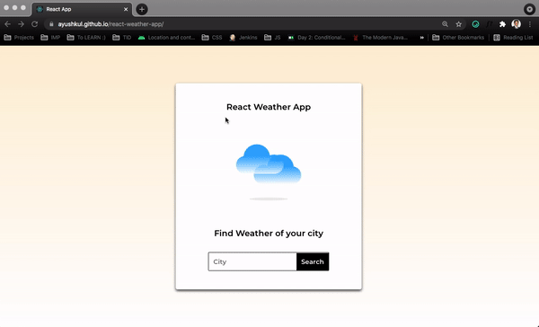

# Weather App - By React JS Project

I have built `Weather App` By `React JS` and `Tailwind CSS styled components` used for styling to my weather app now days used frequently to see weather of your country

## Demo - Deployed over Github Pages 
https://HamzaZaidiX.github.io/weather-app

## Materials used
- `Tailwind CSS Styled-Components`
- `Axios`
- `React-scripts`

## APIs Used
[Open Weather APIs](https://openweathermap.org/)

## API Info
* Method: `GET`
* URL: `https://api.openweathermap.org/data/2.5/weather?q={CITY_NAME}&appid={API_KEY}`

## Icons & Font
* Icons: [ayushkul/react-weather-app](https://github.com/HamzaZaidiX/weather-app/tree/master/public/icons)
* Font Link: `<link href="https://fonts.googleapis.com/css2?family=Montserrat:wght@400;500;600&display=swap" rel="stylesheet">`

## Credits
**From Whom I get the Idea of Project and how to work on this project UI/UX** [**Ayushkul**](https://github.com/ayushkul/react-weather-app)

## Licence
`MIT LICENCE` Read `Licence` document for more details ->

# Bye! 👋

HOPE U LIKE THIS PROJECT PLEASE! IF YOU ARE USING THIS CODE PLEASE GIVE **HAMZA ZAIDI** SOME CREDITS BY LIKE & GIVE A HEART!!! 😃👍💛
